  
   
  

I’ll be offline for a while, but feel free to drop me a message anytime via [X](https://x.com/MichaelXu25). ✨

<!-- Character animations live in ascii/. Run: node ascii/generate.mjs -->

<!--
**yaowenxu/yaowenxu** is a ✨ _special_ ✨ repository because its `README.md` (this file) appears on your GitHub profile.
-->
